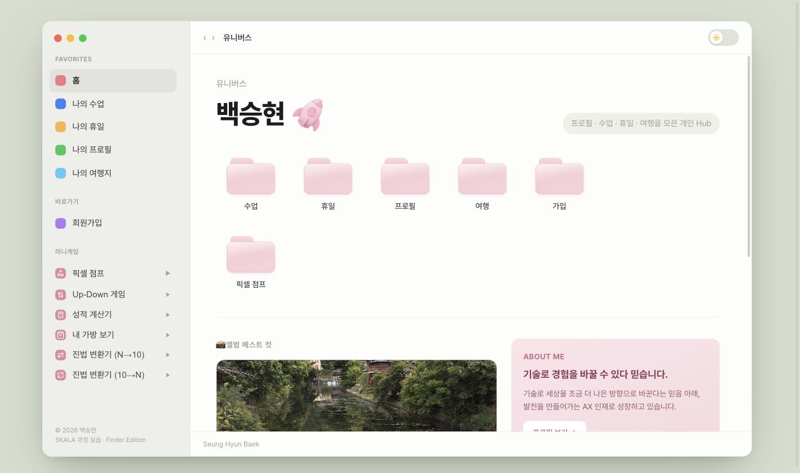
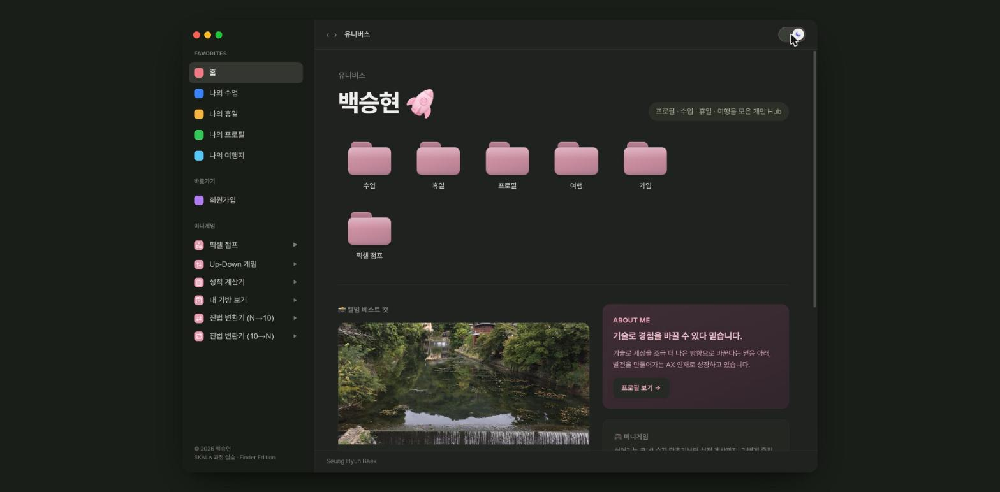
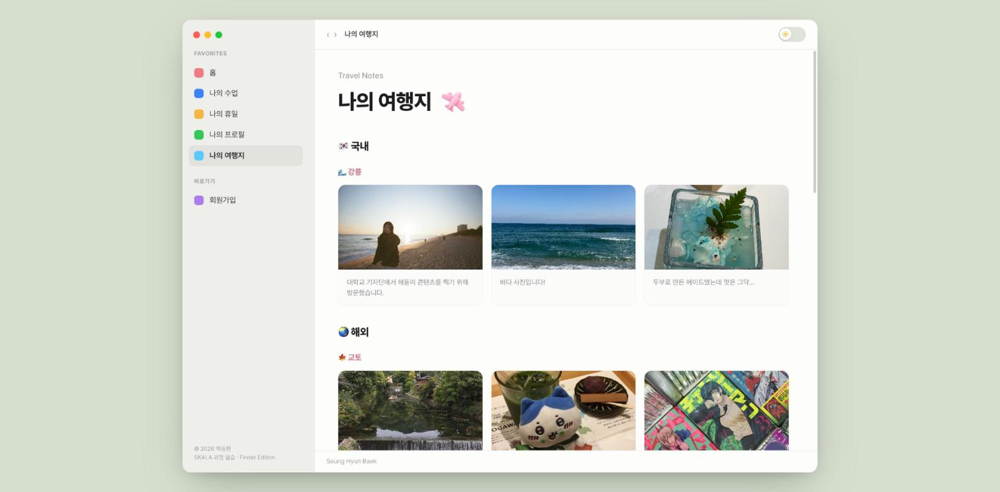
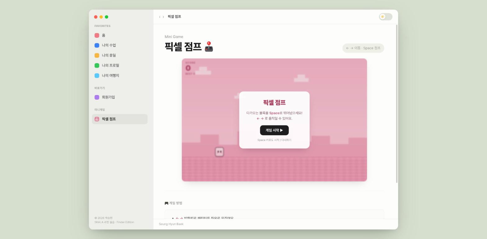

<div align="center">

# 🚀 SKALA FRONT 과제 제출

**macOS Finder 감성으로 만든 나만의 개인 Hub**
프로필 · 수업 · 휴일 · 여행을 한곳에 모은 정적 웹사이트

<br>


</div>

---

## ✨ 소개

**SKALA 과정** 프론트엔드 실습으로 만든 개인 포트폴리오형 사이트입니다.
프레임워크 없이 **순수 HTML · CSS · JavaScript**만으로, macOS Finder 창을 닮은 UI 위에
소개·여행·미니게임·실시간 날씨까지 담았습니다.

> 기술로 세상을 조금 더 나은 방향으로 바꾼다는 믿음 아래, 발전을 만들어가는 **AX 인재**로 성장하고 있습니다.

---

## 🖼️ 미리보기

<table>
  <tr>
    <td width="50%"><br><sub><b>🏠 홈 · 유니버스</b> — 폴더 그리드 · 날씨 · 미니게임</sub></td>
    <td width="50%"><br><sub><b>🌙 다크 모드</b> — 토글로 변경 가능한 테마</sub></td>
  </tr>
  <tr>
    <td width="50%"><br><sub><b>✈️ 나의 여행지</b> — 국내·해외 여행 갤러리</sub></td>
    <td width="50%"><br><sub><b>🕹️ 픽셀 점프</b> — DOM 기반 점프 게임</sub></td>
  </tr>
</table>

---

## 🎨 주요 기능

| 기능 | 설명 |
|------|------|
| 🖥️ **Finder 스타일 UI** | 사이드바 · 툴바 · 폴더 그리드로 구성한 macOS 감성 레이아웃 |
| 🌗 **다크 모드** | 저장된 선택 또는 OS 설정(`prefers-color-scheme`)을 따르는 무깜빡임 테마 |
| 🌏 **실시간 세계 날씨** | Open-Meteo API로 도시별 실시간 날씨 조회 (ES Module · async/await) |
| 📝 **회원가입 폼** | 다양한 `input` 타입과 유효성 검사, 결과 페이지 연동 |
| 🎮 **미니게임 모음** | 아래 6종의 가벼운 인터랙션 게임 |

---

## 🕹️ 미니게임

| 게임 | 파일 | 내용 |
|------|------|------|
| 픽셀 점프 | `pixelJump.js` | `←` `→` 이동 · `Space` 점프하는 횡스크롤 게임 (canvas 없이 DOM만으로) |
| Up-Down 숫자 맞추기 | `upDown.js` | 1~50 사이 숫자를 Up/Down 힌트로 추리 |
| 성적 계산기 | `grade.js` | HTML·CSS·JS 점수로 총점·평균·등급·합격 판정 |
| 내 가방 보기 | `bag.js` | 소지품을 객체 배열로 관리하고 목록 출력 |
| 진법 변환기 (N→10) | `baseConverter.js` | N진법 문자열을 10진수로 변환 |
| 진법 변환기 (10→N) | `baseConverter.js` | 10진수를 N진법 문자열로 변환 |

---

## 📁 프로젝트 구조

```
skala-front/
├── html/                   # 페이지
│   ├── index.html          # 홈 (유니버스 · 날씨 · 게임)
│   ├── myProfile.html      # 나의 소개
│   ├── myClass.html        # 나의 수업
│   ├── myHoliday.html      # 나의 휴일
│   ├── myTrip.html         # 나의 여행지 (이미지·영상·오디오)
│   ├── pixelJump.html      # 픽셀 점프 게임
│   ├── signUp.html         # 회원가입
│   └── signUpResult.html   # 가입 결과
├── css/
│   └── style.css           # 전체 스타일 (다크모드 포함)
├── js/
│   ├── theme.js            # 다크모드
│   ├── weatherAPI.js       # 날씨 데이터 모듈 (좌표·API 호출)
│   ├── realtimeInfo.js     # 날씨 화면(DOM) 모듈
│   ├── pixelJump.js        # 픽셀 점프 게임
│   ├── upDown.js           # Up-Down 게임
│   ├── grade.js            # 성적 계산기
│   ├── bag.js              # 내 가방 보기
│   └── baseConverter.js    # 진법 변환기
└── media/                  # 이미지 · 영상 · 오디오 · 아이콘
```

---

## 🚀 실행 방법

정적 사이트라 별도 빌드가 필요 없습니다. 다만 `realtimeInfo.js`가 **ES Module**을 사용하므로
`file://`이 아닌 **로컬 서버**로 여는 것을 권장합니다.

```bash
# 저장소 클론
git clone <repo-url>
cd skala-front

# 로컬 서버 실행 (둘 중 택1)
python3 -m http.server 8000
# 또는
npx serve
```

브라우저에서 **http://localhost:8000/html/index.html** 접속

> 💡 그냥 `html/index.html`을 더블클릭해도 대부분 동작하지만, 실시간 날씨 모듈은 로컬 서버에서 정상 작동합니다.

---

## 🛠️ 기술 스택

- **HTML5** — 시맨틱 마크업, 다양한 폼 요소, `<video>` / `<audio>`
- **CSS3** — Flexbox · Grid · CSS 변수 · 다크모드 · 반응형
- **JavaScript (ES6+)** — DOM 조작 · 이벤트 · `import`/`export` 모듈 · `async`/`await` · `fetch`
- **Open-Meteo API** — 무료 실시간 날씨 데이터

---

<div align="center">

**© 2026 백승현 (Seung Hyun Baek)** · SKALA 과정 실습 · *Finder Edition*

</div>
